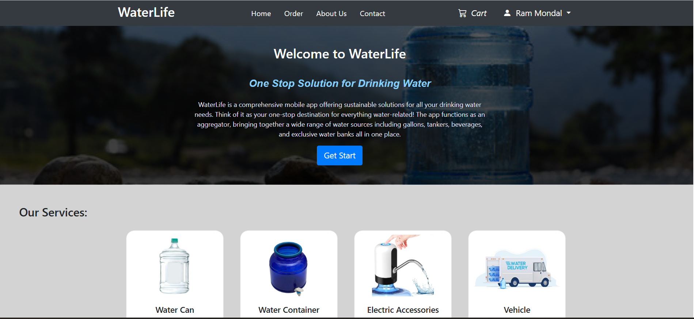
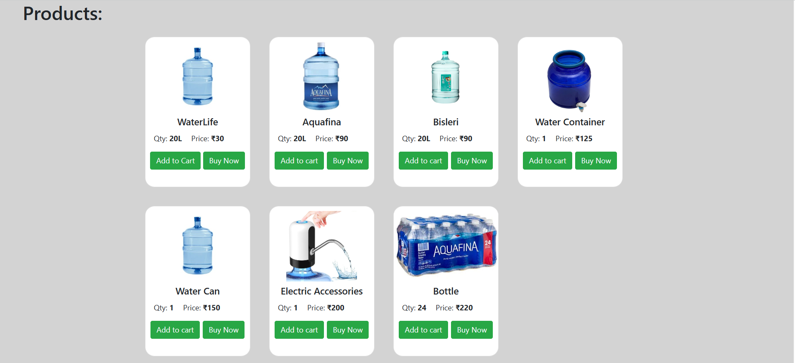
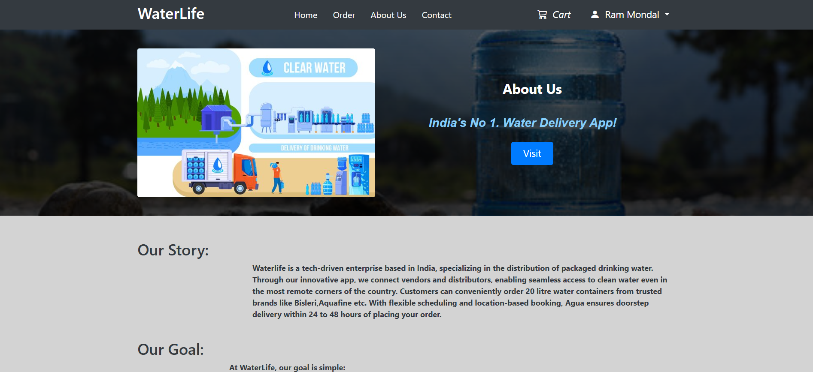
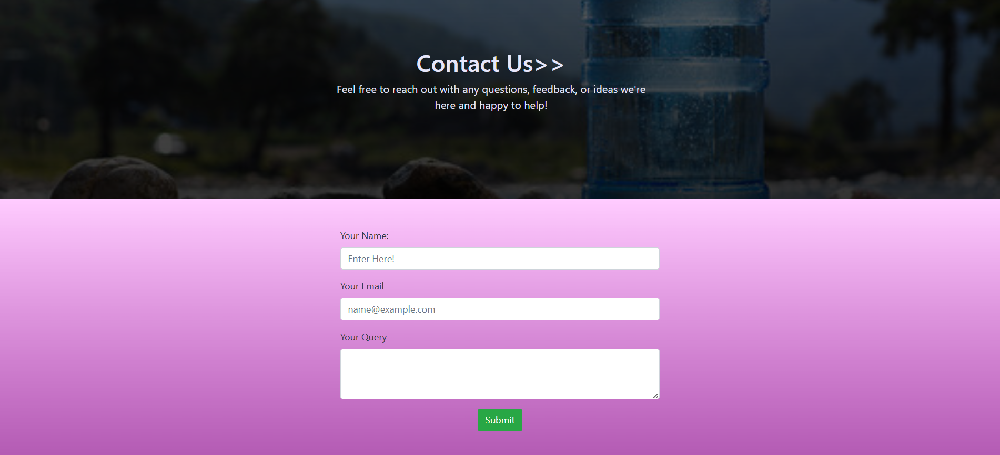
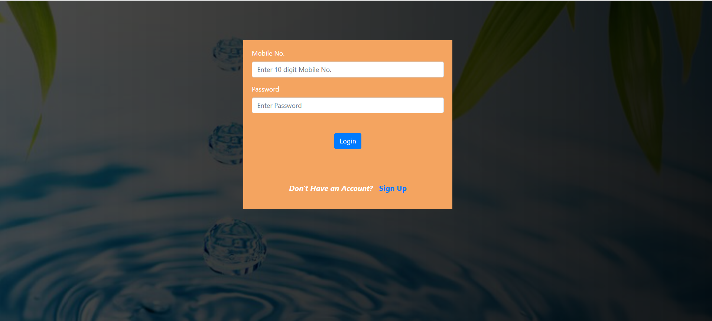
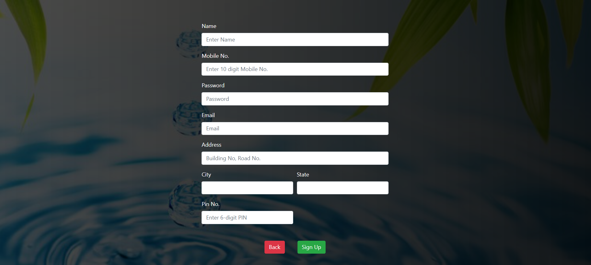
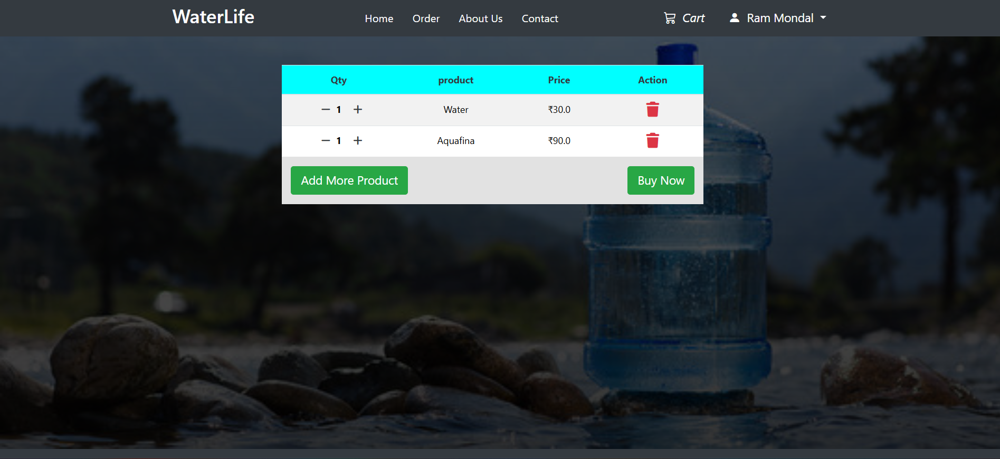
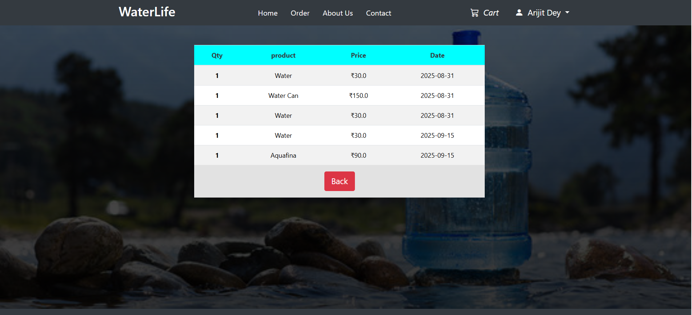

# WaterLife 💧
*A Smart Water Delivery Web Application*

## 📌 Overview
**WaterLife** is a Java-based web application built using **Spring MVC architecture**.  
It provides a smart way for users to order water online, manage their carts, track order history, and get delivery support.  

The app follows the **Model-View-Controller (MVC)** design pattern, ensuring clean separation of concerns between presentation, business logic, and data access.

## 🚀 Features
- 🔐 User Authentication – Sign up & login securely  
- 🛒 Product Page – Browse and select water products  
- 🛍️ Cart Management – Add, remove, and update items in the cart  
- 📦 Order History – Track past and ongoing orders  
- 💳 Easy Checkout – Place orders quickly and securely  
- 📞 Contact Support – Query form for customer support  
- 🏠 Home & About Pages – Showcase app features and mission


## 🛠️ Tech Stack
- **Frontend:** JSP, HTML, CSS, JavaScript  
- **Backend:** Java, Spring MVC, Hibernate  
- **Database:** MySQL  
- **Server:** Apache Tomcat  
- **Build Tool:** Maven  


## 📂 Project Structure

```
WaterDelivery-App/
│── src/main/java/com/waterapp
│ │── controller       # Spring MVC Controllers
│ │── dao              # Data Access Objects
│ │── entities         # Entity Classes (Hibernate)
│ │── service          # Business Logic Layer
│
│── src/main/webapp
│ │── WEB-INF/
│ │ │── views/         # JSP Files (UI Pages)
│ │ │── web.xml        # Deployment Descriptor
│ │ │── spring-servlet.xml      #Database Setup & Project Config file
│ │
│ │── resources/       # CSS, JS, Images
│
│── pom.xml            # Maven Dependencies
│── screenshot         #website designs
│── LICENSE
│── README.md          # Project Documentation
```

---

## ⚙️ Installation & Setup

### 1. Clone the repository
```bash
git clone - https://github.com/Arijitdey27/WaterDelivery-App.git
```

### 2. Configure Database

#### 1. Open MySQL and Create a database
```bash
CREATE DATABASE waterapp;
```

#### 2. Update the database configuration inside the project bean (e.g., spring-servlet.xml ):
```bash
String url = "jdbc:mysql://localhost:3306/waterapp"; // Update port if different
String username = "your-username";  
String password = "your-password";
```

#### 3. Insert in table products manually
```bash
INSERT INTO products (product_id,product, quantity, price) 
VALUES 
(1,'Water', '20L', 30),
(2,'Aquafina', '20L', 90),
(3,'Bisleri', '20L', 90),
(4,'Water Container', '1', 125),
(5,'Water Can', '1', 150),
(6,'Electric Accessories', '1', 200),
(7,'Aquafina Bottle Pack', '24', 220);
```

⚠️ Note:
Update port number, database path, username, and password according to your local MySQL configuration.


### 3. Deploy on Tomcat

- Select the Project.
- Run the project
- Start the Tomcat server.
- Access the app in your browser:

```bash
http://localhost:8080/WaterDelivery-App/  //update poet if different
```
## Screenshots

#### Home/Index page


#### Products


#### About Us


#### Contact Us


#### Login Page


#### SignUp page


#### Your Cart


#### Order History


---

## Contributing

Contributions are welcome! Feel free to open an **issue** or submit a **pull request**.

## License

This project is licensed under the MIT License. See the [LICENSE](./LICENSE) file for more details.
